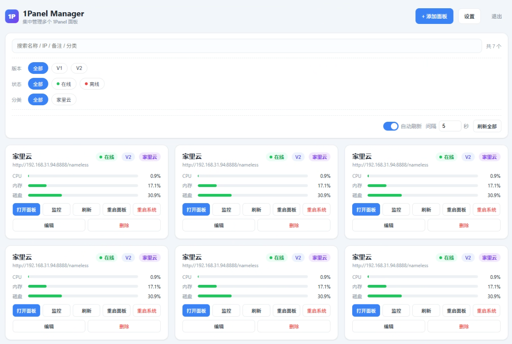
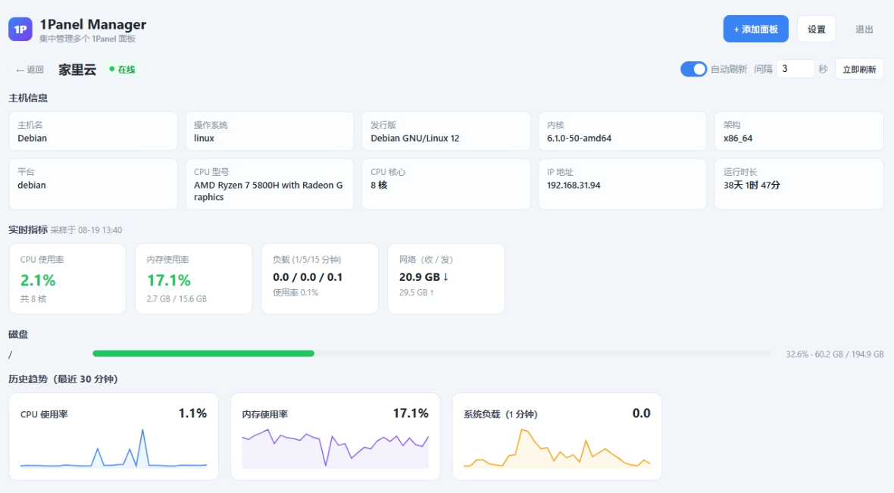
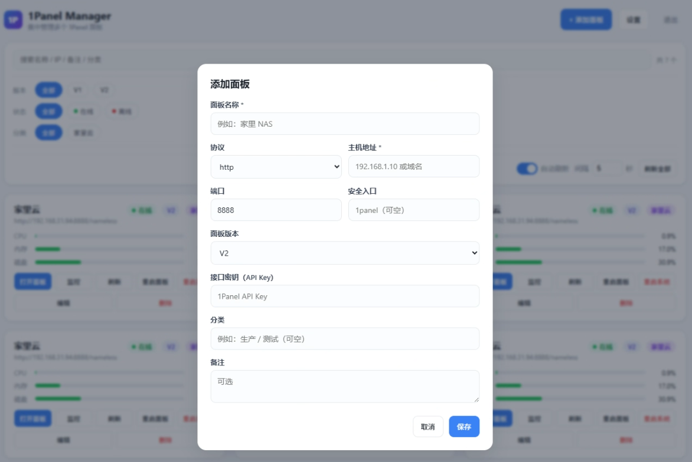

<p align="center">
  <picture>
    <source media="(prefers-color-scheme: dark)" srcset="docs/images/readme-header-dark.svg">
    
  </picture>
</p>

一个基于 **Node.js + Vue 3 + SQLite** 的 [1Panel](https://github.com/1Panel-dev/1Panel) 面板集中管理工具。通过一个页面记录并管理多台 1Panel 面板（V1 / V2 混合），支持资源监控、批量状态查看、应用管理（启动/停止/重启/升级/卸载）与快捷跳转，手机端也能良好适配。

---

## 1. 前言

本项目是由于某个靓仔老是忘记面板地址，又因不是专业版，APP 不能统一管理，在闲暇时间开发的，所以代码大部分靠 AI 生成，没有做过多的优化，仅供参考。不确保后续是否会继续维护，主要是 Token 不够用了（强烈谴责程总不借我点不用还的 Token），如果有需要，可以自行 fork。

## 2. 功能特性

- **多面板集中管理**：记录每台面板的「名称、协议、地址、端口、安全入口、面板版本（V1/V2）、接口密钥、备注、分类」。
- **V1 / V2 兼容**：自动适配两套 API 的鉴权、路由、字段名差异（详见下方「V1 / V2 适配说明」）。
- **一键打开面板**：以 `window.open` 在新标签页打开 1Panel 真实地址，规避跨站 iframe 的 Cookie 限制。
- **实时资源监控**：接入 1Panel API，在首页卡片直接查看 CPU / 内存 / 磁盘占用（带进度条）。
- **监控详情页**：查看主机信息、CPU / 内存 / 负载 / 网络、磁盘分区等。
- **历史趋势图表**：监控详情页「首页」Tab 以曲线图展示最近 30 分钟趋势，包含 **平均负载、CPU 使用率、内存使用率、硬盘 IO（读 + 写）、网络（收 + 发）** 五项，卡片自动平均铺满整行。
- **在线状态检测**：实时展示每台面板的在线 / 离线状态。
- **分类管理**：为机器设置分类，支持按分类快速筛选。
- **搜索**：按名称 / IP / 备注 / 分类模糊搜索。
- **组合筛选**：按「版本（V1/V2）」「状态（在线/离线）」「分类」多维度组合过滤。
- **自动刷新**：首页列表与监控页均支持自动刷新，开关与间隔秒数可配置，并持久化到数据库。
- **应用管理**：监控详情页「应用」Tab，查看已安装应用列表、状态、端口、路径；支持按状态筛选（全部 / 运行中 / 已停止 / 异常 / 任务执行中 / 可升级），并支持启动、停止、重启、重建、卸载、升级操作。
- **应用状态按钮规则**：应用处于 `installing / uninstalling / rebuilding / upgrading` 等过渡状态时，自动隐藏全部操作按钮，避免误操作；`upgrading` 时升级按钮自动禁用。
- **应用重建**：基于现有配置重建应用（`rebuild`），V1 / V2 面板均支持。
- **应用卸载确认弹窗**：可勾选「强制卸载 / 删除备份 / 删除镜像 / 删除数据库」等选项，V1/V2 各自支持的字段不同。
- **应用升级**：自动检测可升级应用（V2 走 `installed/search + update:true`，比商店对比接口可靠），一键升级自动补齐 `detailId` / `version` / `dockerCompose` 等参数，兼容 1Panel 不同版本字段名差异。
- **升级选项**：升级弹窗可勾选「升级前备份应用 / 拉取新版本镜像 / 升级完成后删除旧镜像」——前两项 V1/V2 均支持且默认勾选，删除旧镜像仅 V2 支持。
- **应用商店同步**：一键同步，分别调用远程商店更新和本地已安装应用同步接口。
- **应用 Logo 显示**：V1 直接读取应用列表里的 base64 图标；V2 走代理获取并缓存，`` 加载失败时自动回退为首字母占位。
- **Docker 状态管理**：容器 Tab 顶部实时展示 Docker 安装与运行状态（自动归一化 V1 的字符串与 V2 的对象两种返回），支持启动 / 停止 / 重启；Docker 未运行 / 未安装时隐藏清理、镜像等依赖运行的入口。
- **容器列表与操作**：展示容器名称、镜像、端口、运行时长与状态，支持按名称 / 镜像 / ID 搜索和按状态筛选（前端即时过滤）；可单选或多选后批量执行**启动 / 停止 / 重启 / 恢复 / 删除**。
- **容器实时占用**：CPU 与内存占用按量级自适应精度显示（空闲容器显示 `~0%` 而非 `0.0%`），容器页打开时按自动刷新间隔定时拉取 stats，数值实时变化。
- **镜像管理**：弹窗列表展示镜像标签、大小、创建时间（V1 / V2 字段差异自动适配）；正在被容器使用的镜像禁止勾选删除，批量删除自动跳过并提示。
- **清理功能**：一键清理已停止的容器（prune container）与无用镜像（prune image）。
- **电源操作**：重启面板（`restart/1panel`）、重启所在系统（`restart/system`）。
- **后台登录鉴权**：访问需密码，未登录无法查看 / 操作任何面板；支持修改密码。
- **会话失效自动登出**：任意业务接口返回 401（会话过期 / 被清除）时，自动清除登录态并回到登录页，无需手动刷新。
- **登录后路由恢复**：未登录时直接访问监控详情页 URL，登录后自动跳回该页面并加载数据。
- **异常页面精简**：面板连接失败时仅显示错误提示，隐藏页签与搜索栏等多余 UI，一目了然。
- **并发保护**：批量刷新采用并发限流 + 链式调度，大量机器也不会造成请求风暴或堆积。
- **卡片式平铺列表**：应用 / 容器列表在桌面端按网格平铺（一行两张卡片），移动端自动退回单列；容器选择框垂直居中、操作按钮整行换行到底部右对齐，窄屏不挤压信息区。
- **移动端自适应**。

---

## 3. 环境要求

- **Node.js >= 22.5.0**（使用内置的 `node:sqlite`，无需编译原生模块）
- 无需安装数据库，数据保存在 `data/panels.db`

---

## 4. 安装与运行

```bash
# 安装依赖
npm install

# 生产模式：直接用 Vite 构建好的产物（dist/）启动，单端口 3000
npm start

# 开发模式：同时启动后端（内部 3001）+ Vite 开发服务器（3000，带热更新）
npm run dev

# 停止残留进程：结束占用 3000 / 3001 端口的进程（端口被占用无法启动时使用），可追加端口参数
npm run stop
npm run stop -- 8080

# 构建前端（生成 dist/，生产模式由 server.js 直接托管）
npm run build
```

> **只需记住一个端口：3000。**
> - 生产模式：`npm start` → Express 直接托管 `dist/`，监听 3000。
> - 开发模式：`npm run dev` → Vite 监听 3000（浏览器访问的端口），后端 Express 在内部 3001 运行；Vite 会自动把 `/api` 请求反向代理到 3001。浏览器全程只与 3000 交互，**同源、零 CORS、无预检**。
>
> 前端使用 **Vite + Vue 3 单文件组件（SFC）** 方案。`src/` 下为组件化源码，`npm run build` 会进行压缩并按路由分包（Vue 运行时、首页、监控页各自独立 chunk，产物位于 `dist/`）。

启动后访问：<http://localhost:3000>

### 环境变量配置

项目根目录下的 `.env` 文件（可参考 `.env.example` 创建）用于配置服务：

| 变量 | 默认值 | 说明 |
| --- | --- | --- |
| `PORT` | `3000` | 对外访问端口（生产模式即 Express 端口；开发模式即 Vite 端口，你访问的就是它） |
| `VITE_PORT` | `3000` | 开发模式 Vite 端口（应与 `PORT` 一致，浏览器访问此端口） |
| `BACKEND_PORT` | `3001` | 开发模式内部后端端口（Vite 自动代理 `/api` 到这里，无需手动访问） |
| `HOST` | `0.0.0.0` | 监听地址（仅本机访问可设 `127.0.0.1`） |
| `CORS_ORIGINS` | _(空)_ | 跨域白名单（逗号分隔）；留空表示允许任意来源。通常无需设置 |
| `DEFAULT_PASSWORD` | `admin123` | 首次启动时初始化的后台密码 |
| `SESSION_TTL_HOURS` | `24` | 后台会话有效期（小时） |
| `PANEL_TIMEOUT_MS` | `8000` | 请求 1Panel API 的超时（毫秒） |

> 配置优先级：**命令行环境变量 > `.env` 文件 > 默认值**。例如 `PORT=8080 npm start` 会覆盖 `.env` 中的 `PORT`。
>
> 使用 Node.js 内置的 `process.loadEnvFile` 加载，无需额外安装 dotenv。

**默认后台密码：`admin123`**（仅当数据库首次初始化时生效，之后请在「设置」中修改）。

---

## 5. 使用说明

1. 打开页面，输入后台密码登录。
2. 点击右上角「添加面板」，填写：
   - **名称**（必填）、**主机地址**（必填）
   - **协议**（http / https）、**端口**（默认 8888）、**安全入口**（可空，无需填 `/`，自动补全）
   - **面板版本**（V1 / V2）、**接口密钥**（1Panel API Key）、**分类**、**备注**
3. 保存后，面板卡片会展示：
   - **名称 / 地址 / 版本 / 分类**徽标
   - **状态**：在线 / 离线（自动检测）
   - **占用**：CPU / 内存 / 磁盘
4. 卡片操作按钮：
   - **打开面板**：新标签页打开该面板真实地址
   - **监控**：进入详情页查看完整资源监控
   - **刷新**：单台刷新在线状态与占用
   - **重启**：重启面板（需正确接口密钥）
   - **重启系统**：重启所在服务器系统（危险操作，二次确认）
   - **编辑 / 删除**：管理面板配置
5. 首页顶部工具栏：
   - **搜索框**：按名称 / IP / 备注 / 分类搜索
   - **筛选**：按版本、状态、分类组合过滤
   - **自动刷新**：开关 + 间隔秒数（默认 5 秒），自动保存到数据库
6. 监控详情页：
   - 查看主机信息、实时指标、磁盘、历史趋势
   - **自动刷新**：开关 + 间隔秒数（默认 3 秒），自动保存
   - 按 F5 刷新页面后，会通过 URL hash 自动恢复当前监控视图
7. 应用管理（监控详情页 → 「应用」Tab）：
   - 查看已安装应用列表，每项展示名称、版本、状态、端口、路径
   - 操作按钮：**启动 / 停止 / 重启 / 重建 / 升级 / 卸载**
   - **状态按钮规则**：应用处于 `installing / uninstalling / rebuilding / upgrading` 等过渡状态时隐藏全部操作按钮（只能等待）；`upgrading` 时升级按钮自动禁用，避免重复触发
   - **卸载弹窗**：可勾选「强制卸载 / 删除备份 / 删除镜像 / 删除数据库」，V1/V2 各自支持的选项不同
   - **同步**：先更新远程应用商店，再同步本地已安装应用
   - **应用 Logo**：V1 直接显示应用列表里的 base64 图标；V2 通过代理获取并显示，加载失败回退为首字母
   - **搜索与状态筛选**：按应用名称、端口、路径模糊搜索；状态下拉可按 全部 / 运行中 / 已停止 / 异常 / 任务执行中 / 可升级 过滤，均为前端即时过滤
   - 可升级的应用右侧有橙色「可升级」徽标
   - **升级弹窗**：选择目标版本后可勾选「升级前备份应用 / 拉取新版本镜像 / 升级完成后删除旧镜像」——前两项默认勾选（V1/V2 均支持），删除旧镜像仅 V2 面板显示且默认不勾
8. 容器管理（监控详情页 → 「容器」Tab）：
   - **Docker 状态卡**：显示 Docker 已安装 / 运行中 / 已停止；支持启动、停止、重启，仅在 Docker 运行中提供「清理容器 / 清理镜像 / 查看镜像」入口
   - **容器列表**：每项展示名称、镜像、端口、运行时长、状态与实时 CPU / 内存占用（按自动刷新间隔定时更新）
   - **搜索与筛选**：按名称 / 镜像 / ID 模糊搜索，按状态（全部 / 运行中 / 已停止 / 已暂停 / 已退出 / 删除中）筛选；均为前端即时过滤，切换无需重新请求
   - **容器操作**：单个或批量执行**启动 / 停止 / 重启 / 恢复 / 删除**；勾选左侧选择框（垂直居中）或点击卡片选中，批量栏显示已选数量；操作按钮在卡片底部整行右对齐
   - **镜像列表弹窗**：展示标签、大小、创建时间；正在使用的镜像显示「使用中」且禁止勾选，多选删除时自动跳过使用中镜像
9. 右上角「设置」修改后台密码，「退出」销毁会话。

---

## 6. 界面预览

<table>
  <tr>
    <td align="center" width="33%"><br>首页（面板列表）</td>
    <td align="center" width="33%"><br>监控详情</td>
    <td align="center" width="33%"><br>添加面板</td>
  </tr>
</table>

---

## 7. V1 / V2 适配说明

1Panel V1 和 V2 在 API 设计上有较大差异，本工具自动适配，无需手动配置（添加面板时选择对应版本即可）。主要差异点：

| 项目 | V1 | V2 |
| --- | --- | --- |
| **鉴权** | `md5("1panel" + API-Key + timestamp)` | `HMAC-SHA256(API-Key, "1panel:" + timestamp)` |
| **基础信息 API** | `GET /dashboard/base/:io/:net` | 同 V1（结构一致） |
| **实时监控 API** | `POST /dashboard/current`，body `{ioOption, netOption, scope}` | `GET /dashboard/current/:io/:net` |
| **监控 scope** | 必须传 `"basic"`（CPU/内存/磁盘/负载） + `"ioNet"`（IO/网络）各一次再合并 | 无此参数 |
| **卸载操作名** | `operate: "delete"` | `operate: "delete"` |
| **卸载支持字段** | `forceDelete` / `deleteBackup` | `forceDelete` / `deleteBackup` / `deleteImage` / `deleteDB` / `taskID` |
| **同步应用商店** | `POST /apps/sync`（一个接口搞定） | `POST /apps/sync/remote` + `POST /apps/sync/local` |
| **升级检测** | 先 `GET /apps/checkupdate` 全局判断，有更新再逐个反向对比版本 | `POST /apps/installed/search` + `{update:true, sync:false}` 直接返回可升级应用列表（官方用法，比 `checkupdate` 可靠） |
| **升级选项** | `backup` / `pullImage` | `backup` / `pullImage` / `deleteImage` |
| **应用图标** | 应用列表自带 `icon` 字段（base64 PNG） | 走 `GET /apps/icon/:appKey` 代理获取 |
| **主机 IP 字段** | `ipv4Addr`（小写 v） | `ipV4Addr`（大写 V） |
| **运行时长字段** | `uptime`（秒数） | `runningTime`（结构化） |
| **发行版字段** | 无 `prettyDistro`，只有 `platformVersion` | 有 `prettyDistro` |
| **Docker 状态** | 返回字符串（`"Stopped"` / `"Running"`） | 返回对象（`{isExist, isActive}`） |
| **镜像大小** | 预格式化字符串（如 `"1.50MB"`） | 数字字节 |
| **容器 stats** | `GET /containers/list/stats` 返回数组，按 `containerID` 合并；`cpuPercent` 为增量占比小数（0~1 级） | 同 V1 |

> 如果你看到的 V1 面板 CPU / 内存 / 磁盘全是 0，那是因为 V1 后端在 `scope: "all"` 下不会采集基础信息。本工具会自动用 `scope: "basic"` 和 `scope: "ioNet"` 各调一次再合并，确保拿到完整数据。

---

## 8. 项目结构

```
1PanelManager/
├── start.js                  # 启动入口（加载 .env、自动处理 node:sqlite 实验标志）
├── stop.js                   # 停止脚本：结束占用 3000 / 3001 端口的残留进程（`npm run stop [端口]`）
├── server.js                 # Express 后端服务与路由
├── vite.config.js            # Vite 配置（端口 / 代理 / 分包）
├── index.html                # 前端 HTML 入口
├── package.json
├── package-lock.json
├── .env                      # 环境配置（端口、密码、超时等，已加入 .gitignore）
├── .env.example              # 环境配置模板
├── .gitignore
├── lib/
│   ├── db.js                 # SQLite 数据访问（node:sqlite，零编译依赖）
│   ├── auth.js               # 后台登录鉴权与会话管理
│   └── panelApi.js           # 1Panel API 客户端（V1/V2 签名、请求、字段适配）
├── public/
│   └── favicon.svg           # 站点图标
├── src/                      # 前端源码（Vite + Vue 3 SFC）
│   ├── main.js               # 入口（引入全局样式）
│   ├── style.css             # 全局样式（由 Vite 打包）
│   ├── App.vue               # 根组件（登录 / 顶栏）
│   ├── router/               # vue-router（hash 路由，懒加载）
│   ├── views/                # 页面视图（HomeView / DashboardView）
│   │   └── dashboard/         # 管理面板各页签组件（HomeTab / AppsTab / ContainersTab）
│   ├── components/           # 通用组件（Modal / Toast / LineChart / ProgressBar / PanelForm / SettingsModal / UninstallModal 等）
│   ├── stores/               # 轻量状态管理（reactive）+ 业务操作函数
│   ├── api/                  # API 客户端封装
│   └── utils/                # 格式化工具
├── dist/                     # Vite 构建产物（npm run build 生成，已加入 .gitignore）
├── docs/
│   ├── swagger/              # 1Panel Swagger 接口文档（v1doc.json / v2doc.json）
│   └── images/               # README 界面截图 + 标题 banner
├── dev/                      # 本地开发测试目录（测试数据 / 脚本等，已加入 .gitignore）
└── data/                     # 运行时生成（panels.db，已加入 .gitignore）
```

---

## 9. API 说明

本管理后台自身的接口。除登录 / 退出外，均需携带请求头 `Authorization: Bearer <token>`。

| 方法 | 路径 | 说明 |
| --- | --- | --- |
| POST | `/api/auth/login` | 后台登录，返回会话 token |
| POST | `/api/auth/logout` | 退出登录 |
| GET | `/api/auth/check` | 校验会话是否有效 |
| POST | `/api/settings/password` | 修改后台密码 |
| GET | `/api/settings/ui` | 读取 UI 设置（自动刷新开关 / 间隔） |
| POST | `/api/settings/ui` | 保存 UI 设置 |
| GET | `/api/panels` | 面板列表 |
| POST | `/api/panels` | 添加面板 |
| PUT | `/api/panels/:id` | 更新面板 |
| DELETE | `/api/panels/:id` | 删除面板配置 |
| POST | `/api/panels/:id/refresh` | 检测在线状态并拉取占用概要 |
| POST | `/api/panels/:id/restart` | 重启面板（1Panel API `restart/1panel`） |
| POST | `/api/panels/:id/reboot` | 重启所在系统（1Panel API `restart/system`） |
| GET | `/api/panels/:id/monitor` | 监控详情（主机信息 + 实时占用 + 历史趋势） |
| GET | `/api/panels/:id/apps` | 已安装应用列表（自动检查可升级版本） |
| GET | `/api/panels/:id/apps/:installId/versions` | 获取可升级版本列表 |
| POST | `/api/panels/:id/apps/:installId/op` | 操作应用（start / stop / restart / rebuild / upgrade / uninstall） |
| POST | `/api/panels/:id/apps/sync` | 同步应用商店（远程 + 本地） |
| GET | `/api/panels/:id/apps/:appKey/icon` | 应用图标代理（支持 `?token=` 参数供 `` 使用） |
| GET | `/api/panels/:id/containers` | 容器列表 |
| POST | `/api/panels/:id/containers/op` | 容器操作（start / stop / restart / unpause / remove，支持批量） |
| GET | `/api/panels/:id/containers/stats` | 容器实时占用（CPU / 内存，按 containerID 合并到容器） |
| GET | `/api/panels/:id/docker/status` | Docker 安装与运行状态（V1 字符串 / V2 对象自动归一化） |
| POST | `/api/panels/:id/docker/op` | Docker 操作（start / stop / restart） |
| POST | `/api/panels/:id/containers/prune` | 清理（container 已停止容器 / image 无用镜像） |
| GET | `/api/panels/:id/images` | 镜像列表（大小、创建时间、是否使用中） |
| POST | `/api/panels/:id/images/remove` | 删除镜像（自动过滤使用中的镜像） |

---

## 10. 1Panel API 鉴权说明

1Panel 接口通过两个请求头鉴权：

| Header | 说明 |
| --- | --- |
| `1Panel-Token` | 签名令牌 |
| `1Panel-Timestamp` | 当前 Unix 时间戳（秒） |

签名生成方式（本工具已封装，无需手动处理）：

- **V1**：`1Panel-Token = md5("1panel" + API-Key + timestamp)`。
- **V2**（推荐）：`1Panel-Token = HMAC-SHA256(API-Key, "1panel:" + timestamp)`。

> 详情见 1Panel 官方文档：[V1](https://1panel.cn/docs/v1/dev_manual/api_manual/) / [V2](https://1panel.cn/docs/v2/dev_manual/api_manual/)。

---

## 11. 注意事项

- **打开面板方式**：使用 `window.open` 打开真实地址，不使用 iframe，因此不存在跨站 iframe 的 Cookie 拦截问题（iframe 方案下 1Panel 返回 `401 ErrAuth` 即源于第三方 Cookie 限制）。
- **历史趋势需面板开启监控**：若监控页历史趋势无数据，请先在该 1Panel 面板的「监控」页面开启监控开关。本工具请求时间已按 1Panel 要求的 RFC3339 格式处理。
- **接口密钥权限**：执行「重启 / 重启系统」等操作需 API Key 具备相应权限；密钥错误或未授权时操作会失败。
- **可升级检测机制**：V2 面板使用 `installed/search + update:true + sync:false` 直接获取可升级应用列表（`sync:false` 避免每次都触发远程商店同步拖慢请求），再逐个查询目标版本；V1 面板因无此参数，沿用 `checkupdate` 全局判断 + 反向对比。两者均会在版本列表为空时视为「不可升级」，避免出现「可升级但点开无版本」。
- **并发与刷新策略**：
  - 批量刷新最多同时并发 5 台，避免连接风暴。
  - 对外请求超时 8 秒，离线机器快速失败不拖慢整体。
  - 定时刷新采用「上一轮结束后间隔 N 秒」的链式调度，不会因一轮耗时超过间隔而堆积请求。
- **数据位置**：所有面板配置与 UI 设置保存在 `data/panels.db`，备份该文件即可备份全部数据。
- **API 路径不含安全入口**：本工具请求 1Panel API 时**不会**在 URL 中拼接「安全入口」（仅打开面板网页时才用），无需在面板配置中纠结 entry 字段。
- **容器 CPU 显示**：1Panel 返回的 `cpuPercent` 是按增量计算的占比，空闲容器常见 `0.000x%` 级别的小值。本工具按量级自适应精度显示（`~0%` / `0.0038%` / `1.64%`），避免小值被四舍五入成 `0.0%` 造成「数据没取到」的误解。
- **端口被占用**：若 `npm run dev` 提示 `EADDRINUSE`，多半是残留的 Node 进程占用了 3000 / 3001 端口，执行 `npm run stop` 即可清理。

---


